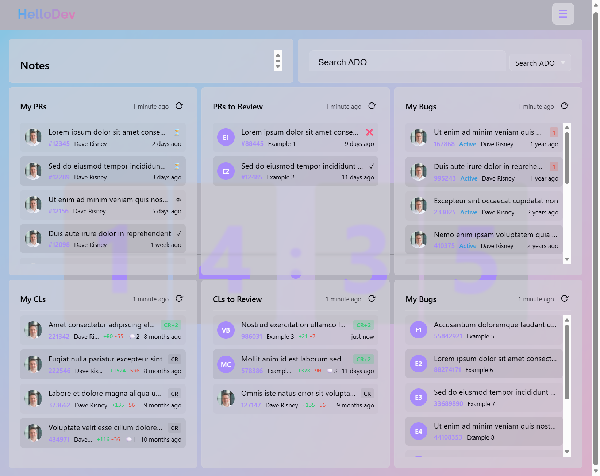

# HelloDev

A customizable new-tab dashboard for Chromium browsers. HelloDev replaces the
default new tab page with a widget-based workspace that surfaces pull requests,
issues, code reviews, and more — right where you start every browsing session.



## Features

### Widget Dashboard
Add, arrange, and resize widgets on a CSS-grid layout. Drag-and-drop
repositioning and per-widget configuration let you build the dashboard that fits
your workflow.

**Built-in widgets:**

| Widget | Description |
|--------|-------------|
| **Markdown** | Rich markdown notes with live preview |
| **GitHub PRs** | Your open pull requests from GitHub |
| **GitHub Issues** | Your assigned issues from GitHub |
| **ADO PRs** | Azure DevOps pull request list |
| **ADO Bugs** | Azure DevOps bug tracker |
| **Gerrit CLs** | Gerrit code reviews (Chromium) |
| **Chromium Bugs** | Chromium issue tracker |
| **Links** | Custom link list |
| **Frame** | Embedded iframe for any URL |
| **Clock** | Live clock with date and time-based greeting |
| **Search** | Configurable search bar with multiple engine templates |

### Widget Packs
Get started quickly with preconfigured pack templates:

- **Starter Dashboard** — Clock, Search, and Markdown notes
- **GitHub Dev** — PRs, Issues, and Search for a GitHub repo
- **ADO Dev** — PRs, Bugs, and Search for an Azure DevOps project
- **Chromium Dev** — Gerrit CLs, Chromium Bugs, and Search

### Themes & Customization
Built-in color presets plus custom primary/accent color pickers. Supports Auto, Light, and Dark modes — Auto follows your OS preference.

### Data Portability
Export your full dashboard configuration as JSON, import a saved layout, or
reset to defaults. Dashboard state syncs across devices via `chrome.storage`.

### Native Host Integration
Optional native messaging host for secure token-based authentication with
GitHub CLI and Azure DevOps, avoiding the need to paste personal access tokens
into the browser.

## Build

HelloDev is loaded directly from the `src` folder, so there is no bundling or
compile step required.

For a local development setup:

1. Install dependencies:

   ```sh
   npm ci
   ```

2. (Optional) Run unit tests:

   ```sh
   npm run test:run
   ```

## Installation

### Chrome / Edge

Not yet available in browser extension stores - but coming in the future.

After completing the [Build](#build) steps above, you can load the extension in
developer mode:

1. Open `chrome://extensions` (Chrome) or `edge://extensions` (Edge)
2. Enable **Developer mode** (toggle in top right)
3. Click **Load unpacked**
4. Select the `src` folder

> This extension uses Manifest V3 and is designed for Chromium-based browsers.

## Project Structure

```
src/
├── manifest.json        # Extension manifest (MV3)
├── hellodev.html        # Dashboard page
├── hellodev.css         # Styles & theme variables
├── hellodev.js          # Core dashboard orchestration
├── widgets/             # Widget implementations
│   ├── WidgetBase.js    #   Base class for all widgets
│   ├── DataWidgetBase.js#   Base class for data-fetching widgets
│   ├── ClockWidget.js   #   Clock & greeting
│   ├── SearchWidget.js  #   Search bar
│   └── ...              #   13 widgets total
├── flyouts.js           # Toolbar flyout panels (add, customize, data, about)
├── widgetConfig.js      # Per-widget configuration dialog
├── widgetPacks.js       # Predefined widget pack templates
├── dragDrop.js          # Drag-and-drop grid positioning
├── theme.js             # Theming engine (auto/light/dark + colors)
├── syncStorage.js       # Cross-device state sync
├── icons/               # Extension icons
└── native-host/         # Native messaging host installer
tests/
├── unit/                # Vitest unit tests
└── e2e/                 # Playwright end-to-end tests
```

## Development & Testing

### Unit Tests

```sh
npx vitest run
```

### End-to-End Tests

```sh
npx playwright test
```

### Validating with Chrome DevTools MCP

This project includes a `.vscode/mcp.json` that configures the
[Chrome DevTools MCP](https://github.com/anthropics/chrome-devtools-mcp) server so
Copilot can launch a browser, install the extension, and verify it works.

**Key setup notes:**

- **`--executablePath`** in `.vscode/mcp.json` must point to your local Edge (or
  Chrome) binary. Update this if your installation path differs.
- **`--category-extensions`** is required to enable extension-management tools
  (install, uninstall, list, reload). Without it those tools won't appear.

**Validation workflow (automated by Copilot):**

1. Install the extension from the `src` folder.
2. Navigate to the extension's new tab page.
3. Confirm zero console errors.
4. Screenshot the page and inspect the DOM for expected elements (greeting, clock,
   toolbar buttons, widget controls).
5. Verify the extension appears enabled with no manifest warnings.

See [`.github/copilot-instructions.md`](.github/copilot-instructions.md) for the
full checklist Copilot follows automatically.
